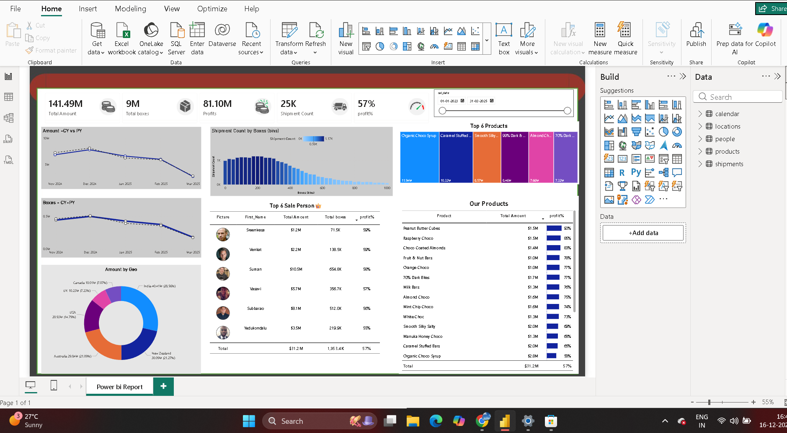

# Chocolate Factory Sales Analysis (Python + Power BI)

## Project Overview
**Project Title:** Chocolate Factory Sales & Profitability Analysis
**Level:** Intermediate
**Tools:** Python (pandas, matplotlib), Power BI (DAX, Power Query)

End-to-end analysis of 25K+ shipment records for a chocolate manufacturing business, combining a Python-based data cleaning + EDA pipeline with an interactive Power BI executive dashboard. The goal wasn't just to report revenue — it was to find out where the business is actually making money, and where it's losing it.

## Objectives
1. **Clean and validate** a messy, multi-sheet raw dataset (25K+ shipment records + 3 dimension tables).
2. **Engineer profitability metrics** — cost, profit, and margin per shipment.
3. **Run exploratory analysis** to identify performance patterns by product, category, region, and sales rep.
4. **Surface risk, not just revenue** — find products, order statuses, and segments quietly hurting profitability.
5. **Visualize findings** in both a Python-generated static report and an interactive Power BI dashboard.

## Dataset
- **Shipments:** 25,076 raw shipment records (ID, sales rep, product, geography, ship date, amount, boxes, order status)
- **Dimension tables:** 22 products (with cost per box), 6 countries across 3 regions, 25 sales reps across 4 teams
- **Time range:** Jan 2023 – Mar 2025

## Project Structure
```
choco-factory-analysis/
├── data/
│   └── sample-chocolate-shipments-data-all-Apr-2025.xlsx
├── notebooks/
│   ├── 01_data_cleaning.py
│   └── 02_eda_and_profitability.py
├── outputs/
│   └── cleaned_shipments.csv
├── visuals/
│   ├── margin_by_product.png
│   └── monthly_revenue_trend.png
├── dashboard-screenshot.png
├── requirements.txt
└── README.md
```

## 1. Data Cleaning (`01_data_cleaning.py`)
- Parsed the raw Excel workbook and extracted 3 separate dimension tables (Product, Geography, Sales Person) packed into a single unlabeled sheet
- Standardized join keys, removed duplicate shipment IDs
- Removed 3 rows with non-positive Amount/Boxes (data entry errors, not valid sales)
- Joined shipments to all dimension tables into a single analysis-ready fact table
- Engineered `Cost`, `Profit`, and `Margin_pct` fields from per-box cost data

## 2. EDA & Profitability Analysis (`02_eda_and_profitability.py`)
Ran a full profitability breakdown across product, category, region, and order status.

### Headline KPIs
| Metric | Value |
|---|---|
| Total Revenue | $141,491,954 |
| Total Profit | $81,102,464 |
| Overall Margin | 57.3% |
| Total Boxes Shipped | 8,831,344 |
| Total Shipments | 25,073 |

### Key Finding #1 — Three products are sold at a net loss
| Product | Revenue | Profit | Margin |
|---|---|---|---|
| 85% Dark Bars | $5.95M | **-$1.99M** | **-33.5%** |
| Baker's Choco Chips | $6.09M | -$0.13M | -2.1% |
| After Nines | $3.81M | -$0.05M | -1.3% |

85% Dark Bars costs more to produce and ship than it earns back — nearly $2M in losses on one product alone. This never shows up if you only look at total revenue.

### Key Finding #2 — Nearly 5% of order value never converts to revenue
| Order Status | Shipments | Revenue | % of Total |
|---|---|---|---|
| Delivered | 21,213 | $120.0M | 84.8% |
| Shipped | 2,173 | $11.9M | 8.4% |
| Cancelled | 1,215 | **$6.93M** | **4.9%** |
| Placed | 472 | $2.63M | 1.9% |

### Key Finding #3 — Best-seller ≠ most profitable
Organic Choco Syrup is the #1 product by revenue ($11.9M) but only converts at a 58.9% margin. Peanut Butter Cubes generates far less revenue ($7.2M) but converts at 90.3% — the highest margin in the entire product line.

### Category & Region Performance
- **Category margin:** Other (60.0%) > Bites (59.4%) > Bars (55.3%) — Bars is the largest category by revenue but the weakest on margin, driven down by the loss-making dark bar products
- **Region margin:** APAC (57.4%) and Americas (57.3%) outperform Europe (56.0%)
- **YoY revenue:** $63.8M (2023) → $62.3M (2024) → $15.3M (2025 partial, through March)

## 3. Power BI Dashboard
The Power BI dashboard mirrors and extends the Python analysis in an interactive executive view: KPI cards, CY vs PY trends, top-6 product and sales-rep leaderboards, a full product profitability table, and a geo revenue breakdown.



## Recommendations
1. **Re-price or discontinue 85% Dark Bars** — it is actively destroying margin at scale
2. **Investigate the cancellation pattern** by region and sales rep to determine if it's a fulfillment issue (fixable) or a demand/pricing issue (structural)
3. **Shift marketing and production focus toward high-margin bites/other-category products**, where profit-per-box is strongest

## Tools Used
- **Python:** pandas (data cleaning, joins, aggregation), matplotlib (visualization)
- **Power BI:** Power Query (data modeling), DAX (profit %, YoY measures, ranking)

## How to Reproduce
```bash
pip install -r requirements.txt
cd notebooks
python 01_data_cleaning.py       # cleans raw data -> outputs/cleaned_shipments.csv
python 02_eda_and_profitability.py   # runs EDA, prints findings, saves charts to visuals/
```
